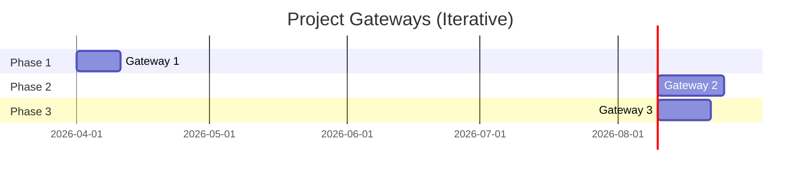

# Milestones & Gateways (Iterative)

## Mermaid Diagram

## Gateways & Milestones
| Milestone/Gateway                | Description                                                                 | Entry Criteria                                 | Exit Criteria                                 |
|----------------------------------|-----------------------------------------------------------------------------|------------------------------------------------|-----------------------------------------------|
| Gateway 1: Project Setup Complete| Project structure, environment, authentication, quality criteria, copilot.  | Repositories and environment configured        | All setup tasks completed and verified        |
| Gateway 2: API & Frontend Ready  | WebAPI endpoints, backend logic, Blazor frontend for project status.         | Backend and API endpoints implemented, DB ready| API and frontend tested, status visible      |
| Gateway 3: Blog & User Testing Complete | Blog post feature, integration, user testing, feedback.                  | Blog feature implemented, integrated, test plan| User testing complete, feedback addressed    |

## Use cases associated with each gateway
| Use Case ID | Description                                 | Milestone/Gateway                | Reference      |
|-------------|---------------------------------------------|----------------------------------|---------------|
| UC-001      | Set up project structure                    | Gateway 1: Project Setup Complete| REQ-F-001     |
| UC-002      | Configure development environment           | Gateway 1: Project Setup Complete| REQ-F-001     |
| UC-003      | Implement authentication                    | Gateway 1: Project Setup Complete| REQ-F-003, REQ-SEC-001 |
| UC-004      | Implement authorization                     | Gateway 1: Project Setup Complete| REQ-F-003, REQ-SEC-001 |
| UC-018      | Implement CI/CD pipeline                    | Gateway 1: Project Setup Complete | REQ-F-006     |
| UC-005      | Develop WebAPI endpoint for README          | Gateway 2: API & Frontend Ready  | REQ-F-004     |
| UC-006      | Develop WebAPI endpoint for code coverage   | Gateway 2: API & Frontend Ready  | REQ-F-004     |
| UC-007      | Develop WebAPI endpoint for authentication  | Gateway 2: API & Frontend Ready  | REQ-F-003, REQ-SEC-001 |
| UC-008      | Develop WebAPI endpoint for code docs       | Gateway 2: API & Frontend Ready  | REQ-F-004     |
| UC-009      | Implement Blazor frontend for project status| Gateway 2: API & Frontend Ready  | REQ-F-001, REQ-U-001 |
| UC-010      | Develop navigation menu                     | Gateway 2: API & Frontend Ready  | REQ-U-001     |
| UC-011      | Develop WebUI for Authentication            | Gateway 2: API & Frontend Ready  | REQ-F-003, REQ-SEC-001 |
| UC-012      | Develop WebUI for Display quality criteria  | Gateway 2: API & Frontend Ready  | REQ-F-002     |
| UC-013      | Develop WebUI for Display copilot agents and instructions | Gateway 2: API & Frontend Ready  | REQ-F-005 |
| UC-019      | Develop Menu items for Help and Contact | Gateway 2: API & Frontend Ready  | REQ-U-001     |
| UC-014      | Implement blog post feature                 | Gateway 3: Blog & User Testing Complete | REQ-F-005 |
| UC-015      | Integrate blog with project status platform | Gateway 3: Blog & User Testing Complete | REQ-F-005 |
| UC-016      | Conduct user testing and gather feedback    | Gateway 3: Blog & User Testing Complete | REQ-U-001 |
| UC-017      | Refine UX based on user feedback            | Gateway 3: Blog & User Testing Complete | REQ-U-001 |

---

- Quality criteria and KPIs are referenced from docs/furps.md and docs/kpi.md.
- Update this file as new gateways are defined or use cases are added.
